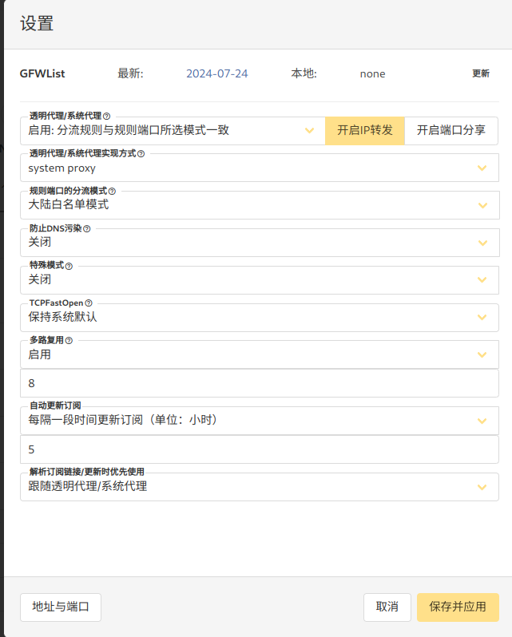

# Windows 平台 v2rayA 安装与配置教程（2025 最新）

> 本文适用于 v2rayA 最新版本，综合多种安装方式与优化实践，面向中高级用户

## 1. 安装 v2rayA

### 方法一：WinGet（推荐）

```powershell
winget install --id v2rayA.v2rayA
```

> 适用于 Windows 10 及以上系统，官方支持，安装自动完成并内置 core

### 方法二：Scoop 包管理器

```powershell

scoop bucket add v2raya https://github.com/v2rayA/v2raya-scoop # Add bucket
scoop update
scoop install v2raya
# 前台运行: 打开一个 CMD 或者 PowerShell 窗口，然后运行
v2rayaWin --lite
# 后台运: 使用 start-v2raya 命令运行 v2rayA，使用 stop-v2raya 命令关掉 v2rayA。
start-v2raya 
```

> 自动安装 v2rayA 及其核心组件，并可设置开机自启。

### 方法三：手动下载安装包

从 [v2rayA GitHub Releases](https://ghfast.top/https://github.com/v2rayA/v2rayA/releases/download/v2.2.4.6/installer_windows_inno_x64_2.2.4.6.exe) 下载类似 installer_windows_inno_x64_x.x.x.exe 的安装程序，双击执行安装。安装后会以 Windows 服务方式运行，并默认开机启动。

习惯脚本方式安装应用的可以使用以下powershell脚本进行安装：

```powershell

# 打开powershell, 普通用户权限即可, 执行以下命令下载v2rayA安装文件，安装文件将会被保存在用户的下载目录下
# 执行下载命令会弹出警告框，因为下载的是.exe文件，点击允许即可开始下载。
powershell -c "invoke-webrequest -uri https://ghfast.top/https://github.com/v2rayA/v2rayA/releases/download/v2.2.4.6/installer_windows_inno_x64_2.2.4.6.exe -outfile Downloads\installer_windows_inno_x64_2.2.4.6.exe"

# 下载完成后，开始安装
Start-Process -FilePath "Downloads\installer_windows_inno_x64_2.2.4.6.exe" -ArgumentList "/silent"

```

## 2. 启动与访问管理界面

安装完成后：

* v2rayA 会作为系统服务运行，默认开机启动，有需要可在任务管理器 “服务” 选项卡中管理。
* 打开浏览器访问管理面板：<http://127.0.0.1:2017>

> 首次访问需创建管理员账号（需记录，如忘记可通过命令 `v2raya --reset-password` 重置密码）

---

## 3. 服务器节点配置与连接

先进行 [订阅购买](https://vip02.stableconnect.cloud/#/plan) ，获取到订阅链接。订阅链接位于：仪表盘 > 一键订阅 , 然后复制订阅地址或者扫描二维码订阅。

* 进入管理界面后，点击 导入按钮 → 填入订阅地址 → 点击确定按钮。
* 切换到订阅对应的Tab, 勾选所有节点， 首先进行ping 测试， 再进行http测试。
* 单击节点对应的“选择”按钮，可多选(v2ray内核)
* 点击右上角启动按钮，节点颜色变为蓝色表示启动成功。

## 4. 设置代理模式
系统代理（System Proxy）
适用于大部分支持代理设置的程序。可在 v2rayA 设置界面开启系统代理（HTTP/SOCKS5）。

透明代理（仅 Linux 支持）
注意：Windows 当前仅支持系统代理，不支持透明代理方式



至此如果一切顺利即可正常访问google和youtube了。

